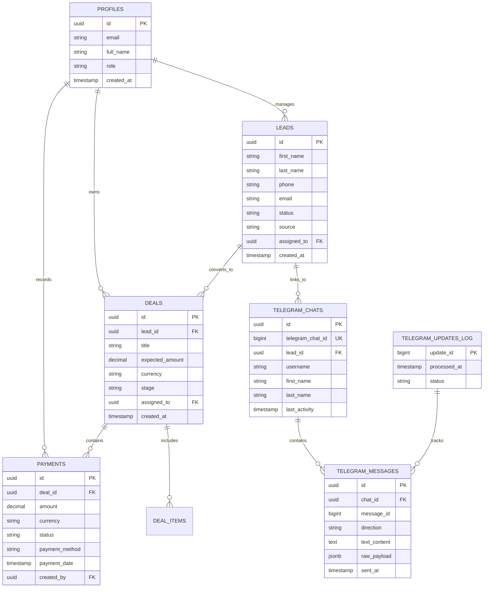

# GravityCRM — Phase 0: Discovery & System Architecture Document

## 1. Загальний огляд проєкту (Executive Summary)

**GravityCRM** — це сучасна, високопродуктивна, безпечна CRM-система нового покоління, оптимізована для управління клієнтами, лійками продажів, фінансовим обліком та омніканальною комунікацією (з фокусом на глибоку інтеграцію з Telegram).

### Ключові принципи системи:
1. **Zero-Trust Security & Strict RLS:** Захист даних на рівні рядків PostgreSQL (Row-Level Security) вмикається з першої міграції. Жоден клієнтський запит не має прямого неконтрольованого доступу до даних.
2. **Server-First Architecture:** Використання Next.js 16 App Router, React Server Components (RSC) та Server Actions для мінімізації клієнтського бандлу, максимальної швидкодії та безпеки.
3. **Ідемпотентний бекенд Telegram:** Усі вебхуки Telegram обробляються виключно через ізольовані Supabase Edge Functions із перевіркою секретних токенів та дедуплікацією `update_id`.
4. **Calculated on-the-Fly Financials:** Фінансові показники (сума оплат, залишок, статус оплати) обчислюються динамічно на основі транзакцій (без дублювання полів та ризику розсинхронізації).
5. **100% Type Safety & Strict Validation:** Повний наскрізний ланцюжок типізації TypeScript та валідація даних через Zod.

---

## 2. Технологічний стек (Technology Stack)

| Рівень | Технологія | Призначення та особливості |
| :--- | :--- | :--- |
| **Frontend Framework** | Next.js 16 (App Router, Turbopack) | Server Components, Server Actions, оптимізований роутинг |
| **UI Library & Runtime**| React 19 | Останні можливості React (Actions, Optimistic updates, use hook) |
| **Language** | TypeScript (Strict Mode) | Наскрізна типізація бази даних, API, форм та компонентів |
| **Styling** | Tailwind CSS | Utility-first стилізація з преміальним темним/світлим дизайном |
| **UI Components** | shadcn/ui + Radix UI | Доступні, кастомізовані та високопродуктивні компоненти |
| **Database & Auth** | Supabase (PostgreSQL 15+) | Реляційні зв'язки, Auth (JWT, SSR), Realtime, Storage |
| **Serverless Functions**| Supabase Edge Functions (Deno) | Швидкі бекенд-ендпоінти для вебхуків Telegram та фонових задач |
| **Data Validation** | Zod | Валідація форм, Server Actions payload та Telegram webhook payloads |
| **Icons & Visuals** | Lucide React | Легкі векторні іконки |

---

## 3. Архітектура безпеки та авторизації (Security & RLS)

### 3.1. Row-Level Security (RLS) Політика
Усі таблиці бази даних створюються з обов'язковим прапорцем `ENABLE ROW LEVEL SECURITY;`.
- **Ізоляція за ролями:** Ролі користувачів (`admin`, `manager`, `agent`, `viewer`) контролюють доступ до таблиць лідів, угод, оплат та налаштувань.
- **Прив'язка до `auth.uid()`:** Кожен запис асоціюється з користувачем або командою/організацією.
- **Service Role:** Ключ `service_role` використовується **виключно** у захищених Edge Functions або бекенд-процесах, і ніколи не потрапляє на клієнт.

### 3.2. Клієнтська та серверна взаємодія із Supabase
- `@supabase/ssr` для безпечної роботи з сесіями та куками в Next.js Server Components, Route Handlers та Server Actions.
- Відсутність публічного доступу до сервісних токенів Telegram API з клієнта.

---

## 4. Схема бази даних та доменна модель (Database Schema)



### 4.1. Фінансовий модуль: Dynamic Calculations
- Заборонено зберігати денормалізовані поля типу `paid_amount`, `balance_due` в таблиці `deals`, щоб уникнути конфліктів та розбіжностей при конкурентних платежах.
- Фінансовий стан розраховується за допомогою:
  1. **PostgreSQL Views** (`deal_financial_summaries_view`) або
  2. **Оптимізованих агрегатних запитів у Server Actions / Database Functions**.
- Формула розрахунку:
  - $\text{Total Paid} = \sum (\text{payments.amount WHERE status = 'completed' AND deal\_id = X})$
  - $\text{Balance Due} = \text{deal.expected\_amount} - \text{Total Paid}$
  - $\text{Payment Status} = \begin{cases} \text{'unpaid'} & \text{якщо Total Paid} = 0 \\ \text{'partial'} & \text{якщо } 0 < \text{Total Paid} < \text{expected\_amount} \\ \text{'paid'} & \text{якщо Total Paid} \ge \text{expected\_amount} \end{cases}$

---

## 5. Архітектура Telegram інтеграції (Edge Functions)

### 5.1. Потік обробки вхідних повідомлень (Incoming Webhooks)
1. **Telegram Servers** надсилають POST-запит на Supabase Edge Function:
   `POST https://<project-ref>.supabase.co/functions/v1/telegram-webhook`
2. **Перевірка безпеки:**
   - Перевірка заголовка `X-Telegram-Bot-Api-Secret-Token` проти значення у захищених змінних оточення (`TELEGRAM_WEBHOOK_SECRET`).
   - Якщо токен не співпадає — негайна відповідь `401 Unauthorized`.
3. **Ідемпотентність (Deduplication):**
   - Перевірка наявності `update_id` у таблиці `telegram_updates_log`.
   - Якщо `update_id` вже існує — повернення `200 OK` (уникнення дублювання при повторах Telegram).
   - Запис нового `update_id` зі статусом `processing`.
4. **Маршрутизація та збереження:**
   - Пошук або створення запису в `telegram_chats` та зіставлення з `leads`.
   - Збереження повідомлення в `telegram_messages`.
   - Оновлення статусу в `telegram_updates_log` на `completed`.

### 5.2. Вихідні повідомлення (Outgoing Messages)
- Клієнтська частина викликає Server Action `sendTelegramMessageAction(chatId, text)`.
- Server Action звертається до Supabase Edge Function або безпечно використовує захищений сервером Telegram API token.
- Клієнт **НІКОЛИ** не має доступу до токена Telegram Bot API.

---

## 6. Структура проєкту (Next.js 16 Modular Architecture)

```
GravityCRM/
├── .github/
│   └── workflows/              # CI/CD автоматизація
├── docs/
│   └── architecture.md         # Документація та схеми архітектури
├── supabase/
│   ├── functions/
│   │   └── telegram-webhook/   # Edge Function для Telegram
│   ├── migrations/             # SQL міграції (схеми, RLS, тригери, в'юхи)
│   └── config.toml             # Локальна конфігурація Supabase
├── src/
│   ├── app/                    # Next.js 16 App Router (RSC за замовчуванням)
│   │   ├── (auth)/             # Авторизація (login, register, forgot-password)
│   │   ├── (dashboard)/        # Основний інтерфейс CRM
│   │   │   ├── dashboard/      # Головна аналітика та KPI
│   │   │   ├── leads/          # Управління лідами (Kanban/Table)
│   │   │   ├── deals/          # Угоди та фінанси
│   │   │   ├── payments/       # Транзакції та історія платежів
│   │   │   ├── telegram/       # Чат-центр Telegram
│   │   │   └── settings/       # Налаштування користувачів та інтеграцій
│   │   ├── api/                # API Route Handlers (тільки якщо потрібно зовнішнім системам)
│   │   ├── layout.tsx          # Кореневий лейаут
│   │   └── page.tsx            # Головна сторінка / редирект
│   ├── components/
│   │   ├── ui/                 # shadcn/ui атомарні компоненти
│   │   ├── shared/             # Спільні компоненти (Header, Sidebar, UserMenu)
│   │   ├── leads/              # Компоненти модуля лідів
│   │   ├── deals/              # Компоненти модуля угод
│   │   ├── payments/           # Фінансові компоненти
│   │   └── telegram/           # Інтерфейс чатів Telegram
│   ├── lib/
│   │   ├── supabase/
│   │   │   ├── client.ts       # Клієнтський Supabase Browser Client
│   │   │   ├── server.ts       # Серверний Supabase Client (RSC & Server Actions)
│   │   │   └── middleware.ts   # Оновлення сесії в Middleware
│   │   ├── utils.ts            # Утиліти (cn, форматування валют, дат)
│   │   └── validations/        # Zod схеми валідації
│   ├── actions/                # Next.js Server Actions (мутації даних)
│   ├── types/                  # TypeScript типи (Database, Domain, View Models)
│   └── middleware.ts           # Middleware захисту роутів та перевірки сесії
├── crm_discovery_phase0.md     # Головний документ фази Discovery
├── README.md                   # Опис репозиторію та інструкції запуску
├── tsconfig.json               # Конфігурація TypeScript (Strict)
├── tailwind.config.ts          # Конфігурація стилів Tailwind
└── package.json                # Залежності проєкту
```

---

## 7. Фази впровадження проєкту (Implementation Roadmap)

| Фаза | Назва | Основні задачі | Статус |
| :--- | :--- | :--- | :--- |
| **Phase 0** | **Discovery & Architecture** | Формування архітектурних вимог, проєктування БД, RLS та Telegram потоку | ✅ Завершено |
| **Phase 1** | **Repository Setup** | Ініціалізація Git, підключення віддаленого репозиторію, документація | 🔄 В процесі |
| **Phase 2** | **Project Setup** | Ініціалізація Next.js 16, Tailwind CSS, shadcn/ui, налаштування середовища Supabase | ⏳ Очікує |
| **Phase 3** | **Database & RLS** | Створення таблиць, RLS-політик, тригерів та розрахункових в'юх | ⏳ Очікує |
| **Phase 4** | **Telegram Integration** | Розгортання Edge Functions, перевірка секретів, логування update_id | ⏳ Очікує |
| **Phase 5** | **Core CRM Features** | Модулі лідів, угод, фінансовий розрахунок на льоту, чат Telegram | ⏳ Очікує |
| **Phase 6** | **Polish, QA & Launch** | Тестування безпеки, оптимізація продуктивності, фінальний реліз | ⏳ Очікує |

---
*Документ є обов'язковим стандартом розробки для всіх учасників та ШІ-асистентів проєкту GravityCRM.*
